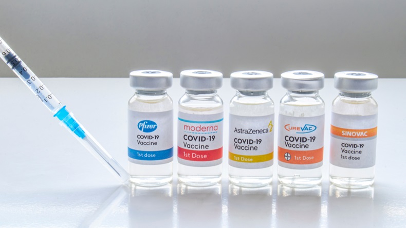
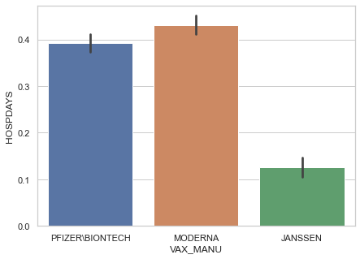
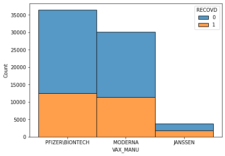
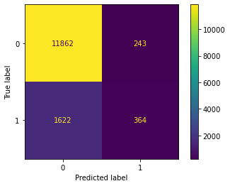
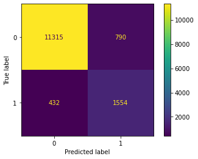

# Covid-19 Averse Vaccine Response Prediction

Author: Christos Maglaras<br>
Date : 4/14/2021
## Stakeholder
This project is mainly focused on serving the induvidual by providing an prediction based on personal information of the possibility of a negative reaction from one of the Covid-19 vaccines. It could also be applied in a medical center such as a clinic or hospital to screen patients easily and quickly. If you would like to know your or anothers risk of illness from one of the three available vaccines you may enter some or all of your personal information into the flask application available within this repository. Successfully being able to predict the outcome of a patient utilizing nothing more than an online form would be higly beneficial to the patient of course, but also the healthcare system by decreasing the amount of strain placed on hospitals. 

## Data

The data utilized for this project has been sourced from the CDC VAERS system, a public dataset consisting of thirty years of domestic adverse vaccine events. Medical professionals and vaccine manufactures are required to report all adverse reactions that come to their attention. While they are required to submit records, anyone can submit a report of their experience. The data consists of general informations such as age and sex, vaccination information like the administration facility and brand, and health information such as preexisting illnesses, allergies, and medications they may take. This dataset contains roughly 70,000 records containing covid-19 vaccines, and is updated every two weeks with new records. You can collect the data [Here](https://vaers.hhs.gov/data/datasets.html?).


Average Days In Hospital Per Brand | Recoveries from Adverse Effects Per Brand
- | - 
 | 

## Business Understanding
This system would alleviate some of the pressure from hospitals, freeing up resources so they can operate more effectively. The first way in which a system like this would help is as a first step screening method, filtering patients to at least notify their clinician of their risks. The second is that in avoiding the adverse reactions, the hospitals do not need to dedicate extra resources to the patient after the reaction. Aulthough we have here seventy thousand cases reporting adverse reactions, the US now has reached five million vaccinations of at least one dose, and three million full vaccinations, meaning that these adverse reactions are only 1.4% of all domestic vaccinations. This is not to say that the 1.4% are to be ignored, with the legal age of the vaccine being sixteen, that leaves two hundred thirty million people eligible for the vaccine in the us, 1.4% being three million.

## Model

The model that achieved the best results was Random Forest optimized using the Bayesian Optimization technique. This achieved significantly better results than both the standard random forests and the xgboost which were not able to produce informative models. Aulthough there is some difficulty differentiating between hospital-bound and those who are not, that is between patients who all had some sort of averse reaction. A real wold test might be more precice as it has been trained on the more difficult task of seperating two groups who are very similar to one another. 

## Conclusions
First Simple Model | Final Model
- | - 
 | 

Recall is the metric which was the focus of optimization, as false negatives represent labelling a risky situation as a safe one, while false positives represent patients who should take the vaccine but are recommended not to, which is not immediatley dangerous in the same way as the former. From the first iteration of the model, optimization strategies were able to bring our recall score up by just short of 70%. This would prove usefull in a real world scenario such as a clinic screening their patients automatically to notify clinicians or doctors to assess the patients risk more closely. Models that were attempted in this and exploratory notebooks were firstly the assortment of thirty basic models included in lazypredict, xgboost, catboost, and a sequential neural network, each trained with normal data and four types of up and downsamling. Each models parameters was tuned using three cross validating methods, randomsearch, gridsearch, and bayesian optimization. This final model using random trees was tuned using random oversampling and bayesian optimization for parameters.

Feature importances are drawn from the Final Models' decision making process, as the weights it applies to each feature. Some of these features may be a negative impact but is represented with a positive, such as the nones.
#### Important Features
Age -- 0.2959 <br>
Previous Vaccinations -- 0.0236<br>
Sex -- 0.0233<br>
Administrator -- 0.0210<br>
Brand --  0.0175<br>
##### Allergy Importance
None -- 0.0049<br>
Penicillin  -- 0.0034<br>
Latex -- 0.0008<br>
Shellfish -- 0.0007<br>
##### Underlying Illness Importance
None -- 0.0112<br>
Asthma -- 0.0033<br>
Hypertension -- 0.0021<br>
Diabetes -- 0.0009<br>
##### Medication Importance
None -- 0.0075<br>
Codeine  -- 0.0011<br>
Amoxicillin -- 0.0007<br>

## Contents
```
├── data
|   ├── vaers_guide.pdf
|   ├── images
|   |   ├── branddied.png
|   |   ├── brandhosp.png
|   |   ├── fsmcorr.png
|   |   ├── finmodcorr.png
|   |   ├── smallcorr.png
|   |   ├── snsbrands.png
|   |   ├── treezoom.png
|   |   ├── vaccines.jpg
|   |   └── vaers.png
|   └── dataset
|       ├── 2020
|       |   ├── data20.csv
|       |   ├── symptoms20.csv
|       |   └── vax20.csv
|       └── 2021
|           ├── data21.csv
|           ├── symptoms21.csv
|           └── vax21.csv
├── flask_app
|   ├── static
|   |   └──css
|   |      └── style.css
|   ├── templates
|   |   ├── after.html
|   |   └── home.html
|   ├── app.py
|   └── model.pkl
├── notebooks
|   ├── Exploration Notebook.ipynb
|   ├── Final Notebook.ipynb
|   └── MVP Final Notebook.ipynb
├── presentation.pdf
└── README.md
```